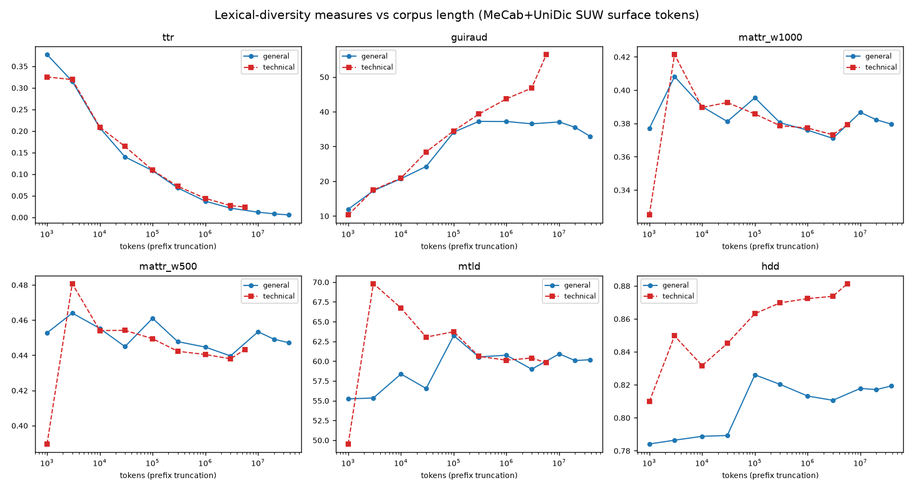

# Lexical diversity and corpus length in Japanese

Measured 2026-07-11. Published 2026-10-04.

Measured by Claude Fable 5 (2026-07-10/11), first written up by Claude Fable 5.1
(2026-09-18), audited against the archived tables and revised by Claude Opus 5.5
(2026-10-04). My contribution was minimal.

Lexical diversity is how varied a text's vocabulary is. The oldest measure is
the type-token ratio (TTR): distinct word forms (types) divided by running words
(tokens). TTR depends on length. As a text grows, new types arrive more and more
slowly, so the ratio falls whatever the text is like. Later measures try to
remove that dependence. This set tests five measures on two Japanese corpora,
across four and a half orders of magnitude of length, and records five findings,
M1–M5.

- [Corpora and method](#corpora-and-method)
- [M1. Technical text has far more hapaxes, and lemmatisation removes few of them](#m1)
- [M2. TTR falls at the rate set by Heaps' law](#m2)
- [M3. Guiraud's index is not length-independent](#m3)
- [M4. MATTR, HD-D and MTLD are effectively length-independent](#m4)
- [M5. Heaps' exponent is above 0.5 on both corpora](#m5)
- [Data files](#data-files)

## Corpora and method

**Tokenisation.** Every token is a short-unit word (SUW) from MeCab (Kudo et
al., 2004), called through fugashi 1.5.2 with the unidic-lite 1.0.8 packaging of
the UniDic dictionary (Den et al., 2008). Tokens with no kana,
kanji or alphanumeric character (pure punctuation and symbols) are dropped.
Types are counted on surface forms. For the lemma comparison in M1 the lemma is
UniDic's 語彙素 field. A token the dictionary does not know has no lemma, so its
surface form is used instead.

**General corpus.** These are texts from Aozora Bunko, a digital library of
Japanese literature. Source: the aozorahack/aozorabunko_text mirror, master
snapshot fetched 2026-07-10.

- Files were read in archive order. Files that do not decode as Shift-JIS
  (cp932) were skipped.
- The explanatory header, ruby, editorial annotations and the colophon were
  stripped.
- Files were added until the cleaned text reached 200,000,000 bytes. Lines were
  then trimmed, blank lines dropped, and the text re-split after each 。, which
  left the 198.7 MB file below.

| | |
|---|---|
| Size | 198.7 MB |
| SHA-256 | `f67585d098fde82208b53f11d85a9de0b2d0c1e8575cf219fc23463cb52a2bfa` |
| Tokens | 38,618,336 |
| Surface types | 204,413 |
| Lemma types | 127,959 |
| Tokens with no lemma | 0.66% |

**Technical corpus.** This is article text from Japanese Wikipedia, fetched
2026-07-11 through the MediaWiki API.

- Articles were collected breadth-first, up to three subcategory levels deep.
  Collection ran first under 工学 (engineering), capped at 6,000 pages (5,937
  articles). It then moved to 化学 (chemistry, 3,768 articles) and stopped when
  the text reached 12 million characters.
- 48 articles reachable from both roots were collected twice. Their text appears
  twice in the corpus (44,097 characters, 0.37%), leaving 9,657 distinct
  articles.
- Wiki markup was stripped and paragraphs under 30 characters were dropped.

| | |
|---|---|
| Size | 12,036,552 characters |
| SHA-256 | `b22434f62ea030ca3b76f98dbb186bbc372f0048f266f80cfe99541daaac975e` |
| Tokens | 5,685,976 |
| Surface types | 134,602 |
| Lemma types | 121,742 |
| Tokens with no lemma | 11.2% |

**Measures.** All are computed on surface forms:

- TTR (types ÷ tokens);
- Guiraud's (1954) index R (types ÷ √tokens);
- MATTR, the moving-average TTR (Covington & McFall, 2010), with windows of 500
  and 1,000 tokens;
- MTLD (McCarthy & Jarvis, 2010), with the standard 0.72 factor threshold,
  averaged over forward and backward passes;
- HD-D (McCarthy & Jarvis, 2007), with the standard sample size of 42.

The reference is Kristopher Kyle's `lexical-diversity` Python package, version
0.1.1. At full
corpus size the package is too slow, so faster exact reimplementations were
used. They match the package to within 10⁻⁶ on 1,000-, 10,000- and
100,000-token prefixes of both corpora; `data/package_verification.csv` has the
values.

**Length sweep.** Each measure was computed on prefixes of the running text, in
reading order. The lengths were 1 and 3 × 10ᵏ tokens from 10³ up to the
corpus size, then 2×10⁷ (general only), then the whole corpus: 11 points for the general corpus and 9 for the
technical one. For each measure an OLS line was fitted to the value against
log₁₀(tokens). That slope, divided by the measure's mean over the grid, is the
measure's **drift per tenfold increase in length**. A length-independent measure
should drift close to 0%.

## M1. Technical text has far more hapaxes, and lemmatisation removes few of them

A hapax is a type that occurs exactly once. To compare at equal size, the general
corpus is cut to its first 5,685,976 tokens, the full size of the technical
corpus.

| | General | Technical |
|---|---:|---:|
| Surface types | 88,116 | 134,602 (+53%) |
| Hapaxes, % of types | 30.6% | 47.0% |
| Dis legomena (types seen twice), % of types | 14.2% | 13.7% |
| Lemma types | 54,113 | 121,742 |
| Types removed by lemmatisation | 39% | 9.6% |
| Hapax types, surface → lemma | 26,930 → 14,517 | 63,206 → 56,800 |
| Hapaxes at lemma level, % of types | 26.8% | 46.7% |

At the lemma level the technical corpus has 2.25 times as many types.
Lemmatisation removes almost half of the general corpus's hapaxes but only a
tenth of the technical corpus's.

**What this does not show.** It does not show why. UniDic's lemma merges both
inflected forms and spelling variants of a word. Lemmatisation also cannot work
on words the dictionary does not know: 11.2% of technical tokens are unknown to
it and keep their surface form as their lemma, against 0.66% across the full
general corpus. This set does not separate how much of the technical corpus's
resistance to lemmatisation comes from its vocabulary and how much from
dictionary coverage. The surface-level rows do not depend on lemmas, so this
limit does not apply to them.

## M2. TTR falls at the rate set by Heaps' law

Heaps' law (Heaps, 1978) says that vocabulary grows as a power of length, V ∝ N^β. TTR is
V/N, so it falls as N^(β−1). On a log-log plot, TTR's slope against length
should therefore equal β − 1.

On the general corpus, TTR falls from 0.377 at 1,000 tokens to 0.0053 at the
full corpus. Its log-log slope is −0.4095. The corpus's Heaps exponent, fitted
separately from its vocabulary-growth curve, is β = 0.592, which gives
β − 1 = −0.408. The two agree to within 0.002. On the technical corpus the slope
is −0.326, which implies β ≈ 0.67.

## M3. Guiraud's index is not length-independent

Guiraud's R = V/√N stays constant only if β = 0.5. On the general corpus R
rises from 11.9 at 1,000 tokens to a peak of 37.2 at 300,000 tokens. It stays
between 35.5 and 37.2 up to 2×10⁷ tokens, then falls to 32.9 at the full corpus.
The fitted trend is +17.0% of R's mean per tenfold increase in length. On the
technical corpus R rises at every grid point, by +34.1% per tenfold increase.

## M4. MATTR, HD-D and MTLD are effectively length-independent

| Measure | Drift per tenfold increase, general | Drift per tenfold increase, technical | Full-corpus value, general | Full-corpus value, technical |
|---|---:|---:|---:|---:|
| MATTR, 500-token window | −0.52% | +0.37% | 0.447 | 0.443 |
| MATTR, 1,000-token window | −0.71% | +0.30% | 0.380 | 0.379 |
| HD-D | +1.00% | +1.87% | 0.819 | 0.881 |
| MTLD | +1.79% | −0.13% | 60.2 | 59.8 |
| *for comparison:* TTR | −65.5% | −60.5% | 0.0053 | 0.0237 |
| *for comparison:* Guiraud's R | +17.0% | +34.1% | 32.9 | 56.4 |

All three drift by less than 2% per tenfold increase on both corpora, against
over 60% for TTR. No one of them is the flattest on both: MATTR with a 500-token
window drifts least on the general corpus, and MTLD drifts least on the
technical corpus. McCarthy and Jarvis (2010) compared MTLD with vocd-D, HD-D, Maas, Yule's K and
TTR on English texts cut into sections of 100 to 2,000 words. MTLD was the only
one that did not vary with length; HD-D did (r = .282 with text length). MATTR
was not part of their comparison. At corpus scale in Japanese, HD-D also passes.

HD-D's drift on the general corpus comes from its rise up to 10⁵ tokens (0.784
to 0.826). From 10⁵ tokens to the full corpus it stays between 0.811 and 0.826,
a drift of −0.25% per tenfold increase. At equal lengths HD-D separates the two
corpora clearly: at 3×10⁶ tokens it is 0.811 for general text and 0.874 for
technical text. It also has the largest technical drift of the three, so the
technical corpus's full-corpus value is not free of length effects.

The smallest points sample only one or two documents. For example, the
1,000-token technical prefix is one 736-token article plus the start of the
next. At those lengths a value reflects particular texts as much as length.

## M5. Heaps' exponent is above 0.5 on both corpora

β is 0.59 for the general corpus, fitted directly, and about 0.67 for the
technical corpus, inferred from TTR's slope in M2. Neither is the β = 0.5 that
Guiraud's index assumes. That is why Guiraud's R fails in M3. TTR fails because
it would be length-independent only if β were 1. The measures in M4 assume no
growth rate, and they pass. The result covers two corpora, segmented into
short-unit words with one dictionary. Other units or dictionaries give different
type counts and may give different exponents.

β also depends on how much text the fit covers. Fitting the general corpus's
growth curve up to 10⁵ tokens gives 0.708; up to 10⁷ gives 0.620; up to the
full corpus gives 0.592 (`data/heaps_general.csv`). The β is the log-log OLS
slope of types against tokens over checkpoints spaced by a factor of 1.15 from
10³ tokens. It comes from a separate tokenisation pass over the same corpus,
with the same tokeniser and filter. That pass counted 38,616,965 tokens and
204,469 types: 1,371 fewer tokens (0.004%) and 56 more types (0.03%) than the
sweep pass.

## Data files

The files are byte-identical copies of the tables the figures above were read
from.

| File | Contents | Used in |
|---|---|---|
| `data/tokens_general.meta.json`, `data/tokens_technical.meta.json` | token, type and lemma counts, and the number of tokens with no lemma | corpus tables, M1 |
| `data/hapax_domain.csv` | type, hapax and dis-legomena counts at equal size, surface and lemma level | M1 |
| `data/sweep_general.csv`, `data/sweep_technical.csv` | every measure at every prefix length | M2–M4 |
| `data/slopes.csv` | per measure and corpus: range, drift per tenfold increase, correlation, log-log slope | M2–M4 |
| `data/package_verification.csv` | fast reimplementations against the reference package | method |
| `data/heaps_general.csv` | Heaps β fitted up to increasing lengths (general corpus) | M2, M5 |

## References

- Covington, M. A., & McFall, J. D. (2010). Cutting the Gordian knot: The
  moving-average type–token ratio (MATTR). *Journal of Quantitative Linguistics*,
  17(2), 94–100. https://doi.org/10.1080/09296171003643098
- Den, Y., Nakamura, J., Ogiso, T., & Ogura, H. (2008). A proper approach to
  Japanese morphological analysis: Dictionary, model, and evaluation. In
  *Proceedings of the Sixth International Conference on Language Resources and
  Evaluation (LREC'08)*. Marrakech: European Language Resources Association.
  https://aclanthology.org/L08-1535/
- Guiraud, P. (1954). *Les caractères statistiques du vocabulaire: Essai de
  méthodologie*. Paris: Presses Universitaires de France. WorldCat OCLC 8416329.
- Heaps, H. S. (1978). *Information Retrieval: Computational and Theoretical
  Aspects*. New York: Academic Press.
- Kudo, T., Yamamoto, K., & Matsumoto, Y. (2004). Applying conditional random
  fields to Japanese morphological analysis. In *Proceedings of the 2004
  Conference on Empirical Methods in Natural Language Processing* (pp. 230–237).
  Barcelona: Association for Computational Linguistics.
  https://aclanthology.org/W04-3230/
- McCarthy, P. M., & Jarvis, S. (2007). vocd: A theoretical and empirical
  evaluation. *Language Testing*, 24(4), 459–488.
  https://doi.org/10.1177/0265532207080767
- McCarthy, P. M., & Jarvis, S. (2010). MTLD, vocd-D, and HD-D: A validation
  study of sophisticated approaches to lexical diversity assessment. *Behavior
  Research Methods*, 42(2), 381–392.

### Data and software

- Aozora Bunko (青空文庫), https://www.aozora.gr.jp/, through the
  aozorahack/aozorabunko_text mirror, https://github.com/aozorahack/aozorabunko_text
- Japanese Wikipedia (ウィキペディア日本語版), categories 工学 and 化学,
  https://ja.wikipedia.org/
- Kyle, K. *lexical-diversity* (version 0.1.1) [Python package].
  https://github.com/kristopherkyle/lexical_diversity
- McCann, P. *fugashi* (version 1.5.2) and *unidic-lite* (version 1.0.8)
  [Python packages]. https://github.com/polm/fugashi,
  https://github.com/polm/unidic-lite
- UniDic. National Institute for Japanese Language and Linguistics.
  https://clrd.ninjal.ac.jp/unidic/
